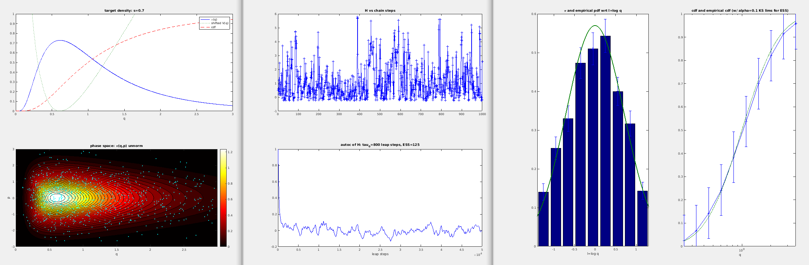

# HMC

Sandbox for Hamiltonian Monte Carlo sampling of pdfs.

Alex Barnett, Feb 2021.

### Currently:

* `hmc1danim.m`: MATLAB script for exploring HMC failure modes in for log-normal target density
* `pics`: results pictures from that script

